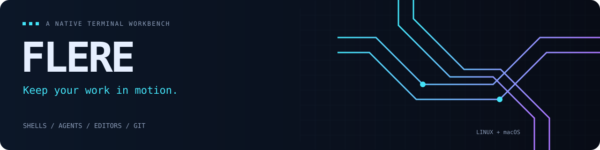
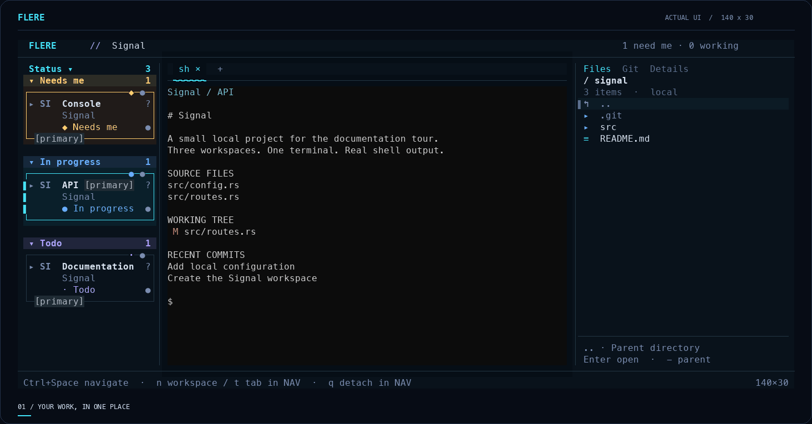
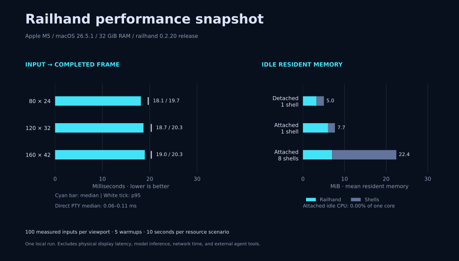

<p align="center">
  
</p>

<p align="center">
  
</p>

<p align="center">
  <strong>Your projects, shells, agents, and editors. One terminal.</strong><br>
  A custom Rust workbench with persistent sessions, local Git inspection, and keyboard navigation.
</p>

<p align="center">
  <a href="docs/getting-started.md">Quick start</a> ·
  <a href="docs/demos.md">Watch the demos</a> ·
  <a href="docs/README.md">Handbook</a> ·
  <a href="docs/performance.md">Performance</a> ·
  <a href="docs/reference/keyboard.md">Keyboard reference</a>
</p>



<p align="center"><sub>Recorded from the Flere 0.3.0 release UI in a real PTY using a generated project. <a href="docs/demos.md">Static screenshots, walkthrough, and recording source →</a></sub></p>

## Keep your projects in reach

| Stay in context | Keep work running | Inspect what changed |
| --- | --- | --- |
| Project cards, shell tabs, native agents, and named editor buffers. Search and switch from the keyboard. | Detach the UI and reconnect to the same processes. Explicit refresh preserves PIDs, terminal history, and unsent drafts. | Browse files and Git history. Open working files or side-by-side Vim/Neovim comparisons. |

Flere owns its UI, renderer, navigation, explorer, and terminal emulator.
Small infrastructure crates handle JSON, Unicode, argv parsing, and OS bindings;
Git, your editor, shells, and agent CLIs run as external programs.

## Start in a project directory

Get the tested Linux x86_64 or macOS arm64 downloads from
[Flere v0.3.0](https://github.com/robert-cronin/flere/releases/tag/v0.3.0).
See [installation channels and package-manager status](docs/distribution.md) for
setup, upgrades and platform limits. The source-build workflow follows below.

From this checkout, with **Rust 1.98+**, Python 3, a system C linker and cached
dependencies:

```sh
./scripts/dev update --with-companion --state "$HOME/.local/state/flere"
"$HOME/.local/bin/flere" --version
```

This validates offline, installs verified managed packages and registers this
checkout for future updates. Use the actual state path when updating an existing
instance; see the [complete setup guide](docs/getting-started.md) for intentional
adoption of a manual installation. Add `~/.local/bin` to PATH, open an ordinary
terminal in your project, and run `flere`. On macOS, the build needs Xcode
Command Line Tools.

**Ctrl+Space** enters navigation. Then **G** adds a project, **n** creates a worktree
card, **t** opens a shell tab, **g** opens Git, and **q** detaches. Run `flere`
again to reconnect. **S** opens the agent harness selector.

> Detach preserves running processes. A supervisor crash or machine reboot retains
> the open-tab layout. Opening Flere reopens each saved agent conversation and
> starts shells in their saved directories, preserving tab order and selection.
> [Understand the lifecycle →](docs/architecture.md#what-survives)

## Historical measurements (0.2.20)

| Median input → frame | p95 input → frame | Idle Railhand RAM | Idle Railhand CPU |
| --- | --- | --- | --- |
| **18.7 ms** | **20.3 ms** | **6.0 MiB RSS** | **0.00% observed** |

Measured on **Railhand 0.2.20**, before the current Ghostline UI and graphics changes.
One local release-build run on **Apple M5 / macOS 26.5.1 / 32 GiB**, at **120×32**
cells. Latency: 100 eight-byte shell-echo samples after five warmups. Resources:
10 seconds idle, supervisor + UI; child shells counted separately. CPU showed no
measurable counter increment during this sample; 100% would mean one core. These are
observations, not a latency guarantee or model-speed benchmark.

[](docs/performance.md)

[Full methodology, percentiles, and raw data →](docs/performance.md)

## Ghostline workspace controls

Keep native terminals in the centre, expand each workspace's terminals with
**Ctrl+Space, h, Tab**, and open its notes, issue/PR links and details with **?**.
Git groups staged, unstaged and untracked files into trees; committed branch
changes appear only when they differ from the local target comparison.

Local Ghostty/Kitty graphics display repository icons, the yellow duck and image
previews without SSH or a companion. Folder loading runs in the background;
**r** in Files retries a failed read. See [workspace trees and details](docs/workspace-details.md)
and the [complete runtime guide](docs/reference/runtime-guide.md) for the current
keyboard, Git, graphics, pet and coordination behaviour.

## Run a task and inspect Problems

Press **Ctrl+Space, !** or choose **Run Task** from Actions. Enter a build or test
command for the selected workspace; **Tab** switches between its label and command,
**Enter** runs it, and **Esc** cancels. Each task gets a new terminal in the focused
pane, leaving existing shell and agent drafts intact.

Press **Ctrl+Space, ;** for **Problems**. **Tab** cycles task results, **j/k** selects
a file location, and **Enter** opens it at the reported line and column in the
configured editor. The task terminal retains interpreted output, including
formats Problems does not recognize. Finished tasks show their exit result and stay
open until closed. Detach and refresh preserve them; after a full supervisor restart,
previously running tasks reopen as ordinary shells in their saved directories,
without repeating commands. Finished task reports are not saved across that restart.

## Explore the workbench

| Guide | What you can do |
| --- | --- |
| [Workspaces, editors, and Git](docs/guides/workspaces.md) | Organize directories, inspect history, and compare revisions. |
| [Native agents](docs/guides/agents.md) | Explicitly start or resume Codex, Claude, or Copilot conversations. |
| [Agent coordination](docs/guides/coordination.md) | Track assignments, messages, decisions, and review states. |
| [Remote sessions](docs/guides/remote.md) | Connect through SSH and understand the optional companion. |
| [Architecture and persistence](docs/architecture.md) | Learn which process owns what, and what survives each lifecycle event. |
| [Troubleshooting](docs/troubleshooting.md) | Resolve navigation, refresh, agent-delivery, and compatibility issues. |

## Platform and project status

| Platform | Evidence |
| --- | --- |
| macOS Apple Silicon | Native port with runtime evidence; see [release scope](docs/releases/0.3.0.md) and [macOS port details](MACOS.md). |
| macOS Intel | Compilation evidence; runtime acceptance pending. |
| Linux x86_64 | First supported target; see [release scope](docs/releases/0.3.0.md) and the [validation record](docs/releases/0.3.0-validation.md). |
| Windows | Optional SSH companion; no native Windows workbench backend. |

Flere is an experimental workbench. Full VT compatibility, older macOS
acceptance, and comprehensive native-agent/physical SSH workflows remain open.
The companion uses each local platform’s clipboard facilities and Sixel image
rendering; physical terminal acceptance remains separate. [Compatibility details](docs/reference/compatibility.md) ·
[macOS port evidence](MACOS.md)

## Build, measure, contribute

[Development guide](docs/development.md) · [Design record](DESIGN.md) ·
[Acceptance checklist](docs/acceptance.md) · [Repository instructions](AGENTS.md)

The handbook, captured demos, chart generators, and benchmark sources live in this
repository. [Reproduce the measurements](docs/performance.md#reproduce-the-run)
or [record a fresh demo](docs/demos.md#record-it-yourself).

## License

Flere is licensed under the [MIT License](LICENSE). The bundled JetBrains Mono
Nerd Font retains its [SIL Open Font License](src/assets/fonts/OFL.txt) and
[Nerd Fonts notices](src/assets/fonts/LICENSE-Nerd-Fonts); see the
[font attribution](src/assets/fonts/README.md).
