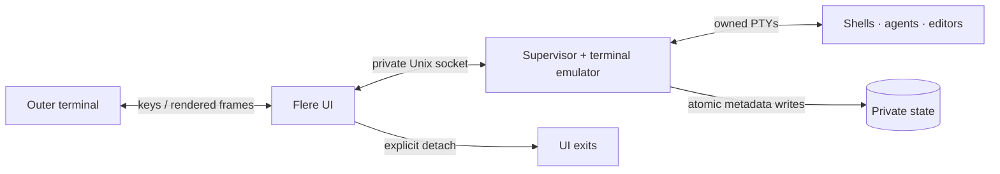

[Documentation](README.md) · [Performance](performance.md) · [Design record](../DESIGN.md)

# A UI you can detach from

Flere runs a supervisor that owns the workspaces, PTYs, emulator state, and
live children. Each UI attachment owns its layout and keyboard interaction.
The supervisor keeps running when an attachment closes.

Terminal bytes pass through Flere's emulator before appearing in the UI.
Flere owns its layout, row renderer, navigation, explorer, and bounded terminal
history. Git, editors, shells, and coding agents are external programs.

## What survives

| Event | Running processes | Drafts and scrollback | Saved workspaces and coordination |
| --- | --- | --- | --- |
| UI detach / reattach | Preserved | Preserved | Preserved |
| Successful explicit refresh | Same PIDs and run identities | Preserved | Preserved |
| Refresh preflight rejected | Old supervisor continues | Preserved | Preserved |
| Supervisor crash / machine reboot | UI opening restores saved agent, shell and editor tabs | Live drafts and scrollback lost; saved chat history belongs to its harness | Retained |

Refresh uses a validated private handoff and same-process exec. It carries owned
file descriptors, child start identities, terminal state, and live socket state.
The replacement verifies compatibility before the old supervisor yields ownership.
See [the design record](../DESIGN.md#workspace-and-refresh-lifecycle) for details.

## Targeting is explicit

A workspace ID identifies saved project context. A session ID and run token
identify a particular live terminal incarnation. Diagnostic input and coordination
operations require the correct target. Native Codex discovery inspects the owned
child tree and its open transcript metadata; it does not select a recent global
conversation by timestamp.

Same-user Unix peer credentials protect the control socket. This is an ownership
check, not a sandbox against other programs running under your OS account.
Native repository, tool, and hook trust decisions stay with the user.

## Where state lives

| Data | Default location |
| --- | --- |
| Workspaces, coordination, socket, logs | `$XDG_STATE_HOME/flere` or `~/.local/state/flere` |
| Lifecycle/error diagnostics | `STATE/diagnostics/`; bounded files per component |
| Child temporary files | `$XDG_CACHE_HOME/flere/tmp` or `~/.cache/flere/tmp` |
| Git comparison snapshots | State-owned `STATE/git-diffs-v1`; [30-day unused retention](git-cache-retention.md), legacy shared cache retained |
| Remote image attachments | Flere cache under `attachments` |

Use `--state DIR` to select an instance. Metadata persistence and process
persistence have different lifetimes. Supervisor-only startup stays idle; opening
the UI restores every saved open tab in order, with the selected workspace and
tab retained. Each agent uses its recorded harness and conversation; a missing
ID opens the harness picker. Shells reopen in their saved directories. Live tabs
are reused. Failed tabs remain available for an explicit retry.

The workspace store is version 6, accepting versions 2–6; refresh handoffs are
version 4, accepting versions 1–4. Older binaries reject the newer formats. Back
up the binary and `workspaces.v2.json` before upgrading if a downgrade is needed.
Restore both only after stopping the supervisor; an old binary cannot preserve
the new live handoff by swapping executables. Existing live tabs are captured on
upgrade. Tabs already closed before this feature cannot be reconstructed from
conversation history alone.

## Read the implementation

[OS bindings](../src/os.rs) · [Supervisor](../src/server.rs) ·
[Local protocol](../src/wire.rs) · [Terminal emulator](../src/terminal.rs) ·
[UI](../src/ui.rs) · [Native identity and delivery](../src/native/delivery.rs)
