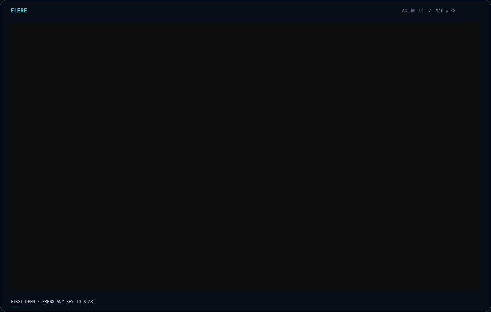

[Documentation](README.md) · [Quick start](getting-started.md) · [Keyboard](reference/keyboard.md)

# A short tour of Flere

## Flere 0.3.0


This recording uses the release UI in a **140×30-cell** owned PTY. The project,
commits and shell output are generated fixtures; no user workspace or native
agent is involved. [Workbench still](assets/flere-030-workbench-1.png) ·
[Git still](assets/flere-030-workbench-2.png) ·
[Search still](assets/flere-030-workbench-3.png) ·
[Board still](assets/flere-030-workbench-4.png).



The renamed intro is captured at **140×38**. [Static frame](assets/flere-030-intro-1.png).
The [capture receipt](assets/flere-030-capture.json) records the executable hash
and embedded build identity. Retained [workbench cells](assets/flere-030-workbench.jsonl.gz)
and [intro cells](assets/flere-030-intro.jsonl.gz) can be rendered without starting Flere.
These are rasterized terminal cells, so glyph appearance depends on the chosen
font; frame sampling is not a latency benchmark.

The [archived Railhand 0.2.20 tour](history/railhand-0.2.20-tour.md) retains earlier recordings and their original provenance.

## Record it yourself

The commands below record a fresh Flere build into your home cache. The published recordings retain their original versions and provenance.


Build the release binary and capture examples, then write the captures into a
home-cache directory:

```sh
cargo build --offline --locked --release --bin flere --example docs_demo --example capture_intro
mkdir -p "$HOME/.cache/flere/docs-results"
./target/release/examples/docs_demo ./target/release/flere \
  "$HOME/.cache/flere/docs-results/workbench.jsonl"
./target/release/examples/capture_intro ./target/release/flere \
  "$HOME/.cache/flere/docs-results/intro-state" \
  "$HOME/.cache/flere/docs-results/intro.jsonl" 100 28
```

The workbench recorder creates its own disposable Git repository, state, and
shells. It never attaches to a running user instance. The intro only opens a
preview. Raw terminal bytes and fixture state stay in the home cache.

Use [the Python environment from the performance guide](performance.md#reproduce-the-run)
and provide a local monospace font file. On macOS, for example:

```sh
"$HOME/.cache/flere/docs-tools/bin/python" docs/tools/render_demo.py \
  "$HOME/.cache/flere/docs-results/workbench.jsonl" "$HOME/.cache/flere/docs-results/workbench.gif" \
  --font /System/Library/Fonts/Menlo.ttc
"$HOME/.cache/flere/docs-tools/bin/python" docs/tools/render_demo.py \
  "$HOME/.cache/flere/docs-results/intro.jsonl" "$HOME/.cache/flere/docs-results/intro.gif" \
  --font /System/Library/Fonts/Menlo.ttc --intro
```

On Linux, pass an installed monospace font such as DejaVu Sans Mono instead.
The renderer uses captured cell contents and colors with a local monospace font
and draws terminal borders on the cell grid. It adds an outer caption/frame and
progress line. Glyph appearance can differ from your terminal font. Font rasterization is an illustration of those
captured cells, not a screenshot of a particular physical terminal application.

The compressed [workbench cells](assets/flere-030-workbench.jsonl.gz) and
[intro cells](assets/flere-030-intro.jsonl.gz) let you render the published capture without
launching Flere. [Capture source](../examples/docs_demo.rs) ·
[Intro source](../examples/capture_intro.rs) · [Renderer](tools/render_demo.py)
