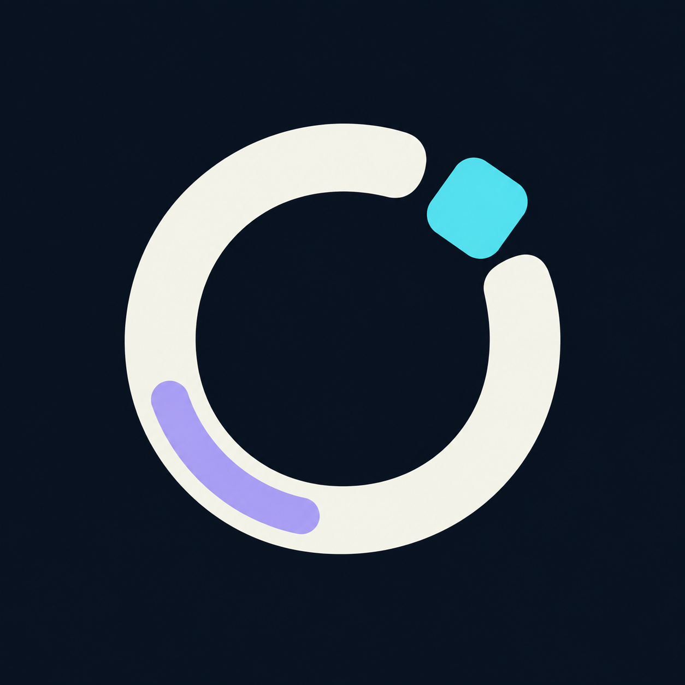

# Flere logo explorations

**Selected: 04 · Open Orbital.** [winner.png](winner.png) is the unchanged, opaque original chosen from ten separately generated concepts. The white open band suggests a shared workspace; the cyan peer has room to move independently. The compact silhouette reads clearly at 32 pixels and in a circular crop. Its white, cyan and lilac palette connects to Flere's drone mascot and terminal theme without requiring a literal mascot portrait or a letter mark.



These are original visual homages to open habitats, autonomous companions and peer coordination. All concepts are symbol-only; the project name is **Flere**, with command `flere`.

## Comparison

[Open the interactive comparison](comparison.html) for original images displayed at 160, 64 and 32 CSS pixels, including a circular 32-pixel crop. [comparison.png](comparison.png) records that browser review. The comparison image is a screenshot of the review page, not a derived production logo.

| Concept | Direction | Selection notes |
| --- | --- | --- |
| [01 · Still Companion](01-still-companion.png) | Tilted white drone and small mood light | Closest to the mascot; gentle and cute, but its thin groove and small satellite weaken at 32 pixels. |
| [02 · Peer Bloom](02-peer-bloom.png) | Three equal, interlocking soft forms | Friendly peer relationship; the flower/rotor reading is less suitable. |
| [03 · Soft Wayfinder](03-soft-wayfinder.png) | Rounded directional courier | Strong small silhouette; can read as a cursor or bird. |
| [04 · Open Orbital](04-open-orbital.png) | Open white workspace band and cyan peer | **Winner:** balanced, compact, readable, and distinct from the literal drone silhouette. |
| [05 · Prompt Cradle](05-prompt-cradle.png) | Terminal brackets around a capsule | Direct terminal connection; more separate details compete at small sizes. |
| [06 · Little Company](06-little-company.png) | Equal companions arranged together | Warm group idea; disconnected pieces lose coherence at 32 pixels. |
| [07 · Folded Courier](07-folded-courier.png) | Rounded triangular ribbon | Clear and polished, but the familiar triangular-loop language feels less distinctive. |
| [08 · Comet Puck](08-comet-puck.png) | Moving capsule with compact trails | Energetic; the trails fade at small sizes and the body can resemble a device connector. |
| [09 · Pocket Mind](09-pocket-mind.png) | Compact three-dimensional block | Solid small icon, but more generic computing/cube imagery. |
| [10 · Pixel Drifter](10-pixel-drifter.png) | Pixel drone with a lilac spark | Cute terminal affinity; the UFO and plus sign make a more literal, generic pictogram. |

## Generation and provenance

Created on 2026-09-13 with the built-in `image_gen.imagegen` tool in **generate** mode: one separate prompt and call per concept, ten calls total. The ten prompts vary the silhouette and visual idea, rather than asking for small variations of one ring. Full prompts are retained in [prompts.json](prompts.json), with retained relative filenames and SHA-256 hashes in [provenance.json](provenance.json).

Each returned image is **1254 × 1254 PNG**. All ten requested outputs are retained byte-for-byte. `winner.png` is a byte-for-byte copy of `04-open-orbital.png`; no artwork was redrawn, resized, alpha-keyed or retouched. The selected file is opaque RGB. Concepts 01, 02, 05, 08 and 09 returned RGBA with transparency despite the opaque-background brief; their original alpha is preserved and the comparison composites them on navy.

The review checked the original images at avatar sizes and inside a circular crop. It selected a clean opaque source suitable for direct display. Future transparent or differently composed production variants should be derived through imagegen and reviewed separately.

## Integration

The selected original is now copied to `.flere/icon.png` and displayed in the repository README. It does not change a personal account avatar or repository visibility.

Suggested repository README markup:

```html
<p align="center"></p>
```

The project icon is a byte-for-byte copy of the selected original.
