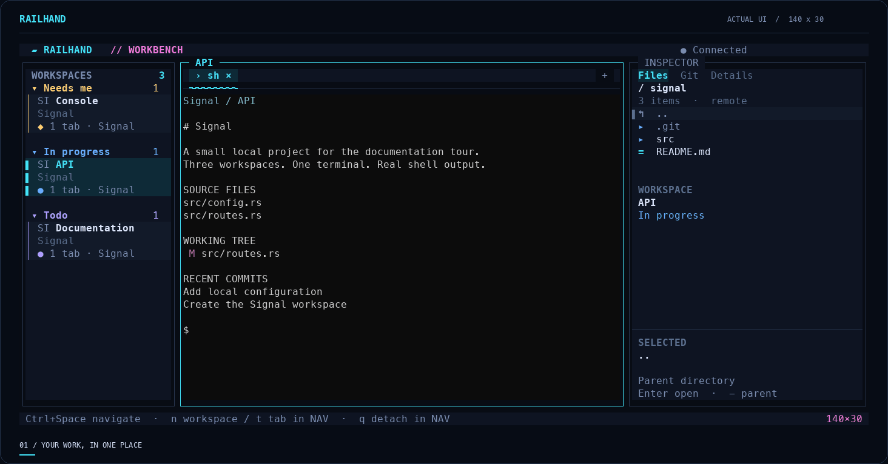
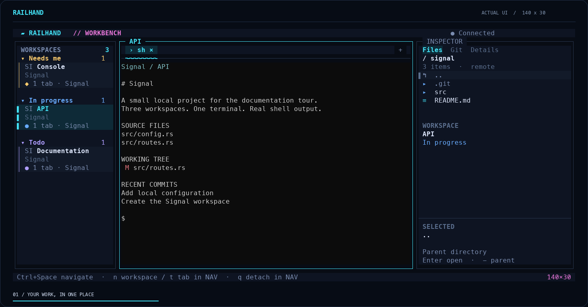
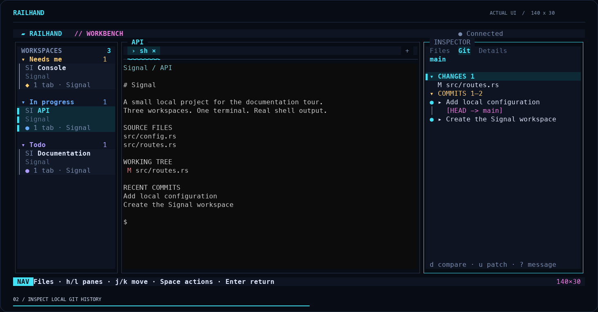
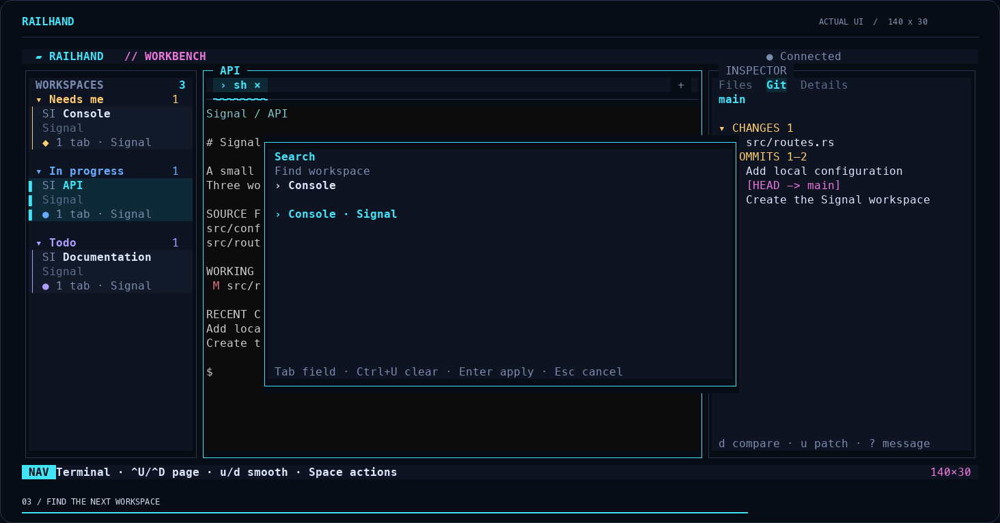
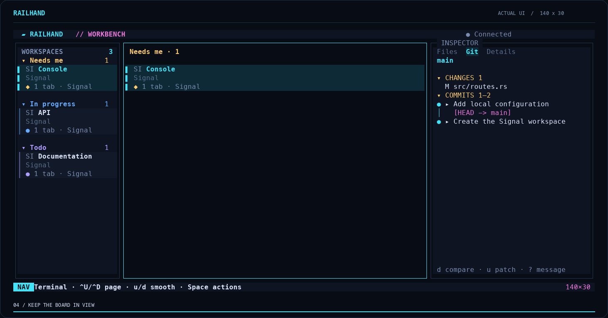
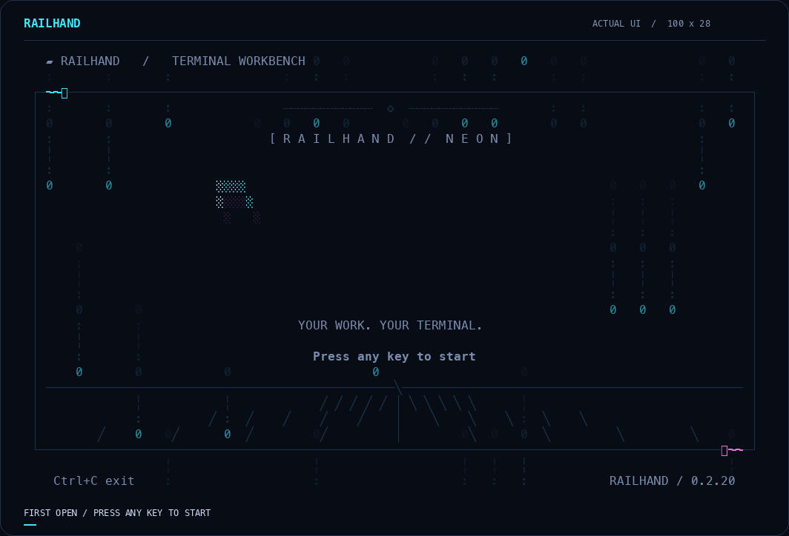

[Current Flere tour](../demos.md) · [Documentation](../README.md)

# Archived Railhand 0.2.20 tour

These are recordings of the real Railhand **0.2.20** UI, decoded from owned kernel PTYs.
The project, files, commits, and shell output are deliberately generated fixtures.
No model responses or benchmark outcomes are staged in the demos. These are
historical captures from runtime revision `cc19456`; that private Git history is
not included in this source snapshot.

## The everyday workbench

| Moment | Recorded behavior |
| --- | --- |
| Workspaces beside a native shell | Railhand opens a fixture project directory. |
| Local working changes and commit history | **Ctrl+Space → g** |
| Search across workspace cards | **Ctrl+Space → /**, type the name, then Enter |
| Review workflow state in the board | **Ctrl+Space → Shift+B**; use h/l to change columns |

The recording uses a **140×30-cell** viewport, a wider Git inspector, and a
synthetic project named Signal. It follows live interactions at captured timing;
the GIF's final frame holds briefly before looping. Captures are sampled up to
10 times per second, so the GIF frame rate is **not a UI latency measurement**.

### Prefer still images?

| Workspaces | Git history |
| --- | --- |
|  |  |
| Search | Board |
|  |  |

## First opening

The **100×28-cell** intro is captured for six seconds. Pressing any key advances
into the workbench.
[View a static intro frame](../assets/intro-1.png).

For current build and recording instructions, use the [Flere tour](../demos.md#record-it-yourself). Do not overwrite these archived artifacts with a new build.
